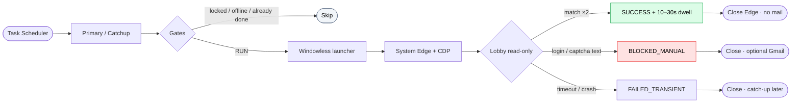

<div align="center">


# Mahjong Soul Windows Daily Opener

### *Passive daily open of Mahjong Soul on your Windows PC—reuse a dedicated Edge session, confirm the lobby, then exit.*

[](#-notes)
[](package.json)
[](package.json)
[](#-highlights)
[](https://github.com/okht/majsoul-windows-daily-login)

[](#-install)
[](#-workflow)
[](#-safety-and-boundaries)
[](#-safety-and-boundaries)

<br>

<table>
<tr><td align="left">

🕘 &nbsp;You want a once-a-day Mahjong Soul open in the local morning window, not a fixed clock alarm.<br>
🖱️ &nbsp;You refuse bots that click login buttons, type passwords, or bypass captchas.<br>
🔒 &nbsp;You need login state, fingerprints, mail secrets, and logs to stay on the PC—never in Git.

</td></tr>
</table>

### ✨ Local Task Scheduler opens a dedicated Edge profile, confirms the lobby read-only, then closes.

**Local 10:00–12:30 → passive Edge (CDP) → lobby match → optional 10–30s dwell → silent exit**

<br>

[✨ Highlights](#-highlights) · [⚡ Install](#-install) · [🚀 Usage](#-usage) · [🧭 Workflow](#-workflow) · [🛡 Safety](#-safety-and-boundaries) · [📂 Structure](#-project-structure) · [📌 Notes](#-notes)

[**English**](README.md) · [**简体中文**](docs/lang/README_ZH.md)

</div>

---

## ✨ Highlights

A **local-only** Windows runner for the CN web client (`https://game.maj-soul.com/1/`). It reuses a dedicated Microsoft Edge profile you log into once, judges the lobby with irreversible visual fingerprints plus accessible text, and never synthesizes input on the scheduled path.

| Capability | What it does | Why it matters |
|---|---|---|
| **Local wall-clock schedule** | Primary task: local **10:00 + up to 2.5h random delay**; catch-up on logon/unlock and from local **12:30** every 15 minutes | Matches “morning at home,” not a hard-coded Beijing-only install rule |
| **Passive Edge via CDP** | Spawns system `msedge` with a dedicated profile and attaches over CDP (Playwright `launchPersistentContext` blacks out WebGL) | Real canvas/WebGL path for lobby detection |
| **Read-only lobby gate** | Fingerprint match (threshold + two consecutive frames); accessible login/captcha text → stop | Confirms presence without clicking into the game |
| **Success dwell** | After `SUCCESS`, keeps the session open for a random **10–30 seconds**, then closes | Gives the client a short settle window without hanging open |
| **Failure-only Gmail** | Optional pure-text mail on failure / manual block; **no mail on success** | Quiet when healthy; alerts only when you must act |
| **Install gates** | `npm run verify` + local acceptance receipt before `Register` | Scheduled tasks only after tests, zero-input scan, privacy scan, and live lobby check |

---

## ⚡ Install

**Requirements:** Windows 10/11 · [Node.js](https://nodejs.org/) **≥ 22** · Microsoft Edge · network to Mahjong Soul (and Gmail SMTP if you enable alerts).

Run every command from the **repository root** (not an empty folder).

```powershell
git clone https://github.com/okht/majsoul-windows-daily-login.git
cd majsoul-windows-daily-login

npm ci
# If npm ci fails on lock/file sync: npm install

npm run verify
```

`verify` = unit/integration tests + zero-input static check + tracked-tree privacy scan.

<details>
<summary><b>🛠️ One-shot deploy modes (after acceptance)</b></summary>

<br>

```powershell
powershell -NoProfile -ExecutionPolicy Bypass -File scripts\install.ps1 -Mode DryRun
powershell -NoProfile -ExecutionPolicy Bypass -File scripts\install.ps1 -Mode Deploy
powershell -NoProfile -ExecutionPolicy Bypass -File scripts\install.ps1 -Mode Register
# Or: -Mode Full   (verify + deploy; Register still needs acceptance receipt)
```

</details>

---

## 🚀 Usage

### Smallest successful path

| Step | Command | Observable result |
|---|---|---|
| **1. Enroll session** | `node src/cli/setup-session.mjs` | Visible Edge: log in and reach lobby, press Enter; headless re-enroll of fingerprint |
| **2. Verify headless** | `node src/cli/verify-session.mjs` | Console includes `SUCCESS` (may take 1–3 minutes) |
| **3. Optional mail** | `node src/cli/configure-gmail.mjs` | Gmail app password stored in Windows Credential Manager only |
| **4. Acceptance** | `npm run acceptance` or `npm run acceptance -- --skip-gmail` | Writes `%LOCALAPPDATA%\MajSoulDaily\acceptance-receipt.json` (local only) |
| **5. Deploy + register** | `install.ps1 -Mode Deploy` then `-Mode Register` | Tasks `MajSoulDaily-Primary` and `MajSoulDaily-Catchup` |

### Day-to-day commands

| Command | Role |
|---|---|
| `npm run verify` | Tests + zero-input + privacy |
| `npm run acceptance` | Local acceptance receipt (optional `--skip-gmail`) |
| `node src/cli/re-enroll-headless.mjs` | Refresh lobby fingerprint without headed login |
| `node src/cli/repair-session.mjs` | Headed repair when the session expires |
| `scripts\uninstall.ps1` | Remove tasks and local app/data (see script options) |

### Manual smoke (after deploy)

```powershell
& "$env:LOCALAPPDATA\MajSoulDaily\app\MajSoulDaily.exe" primary
```

Check next run:

```powershell
Get-ScheduledTaskInfo -TaskName "MajSoulDaily-Primary"
```

---

## 🧭 Workflow



### Runtime data (never committed)

| Path | Contents |
|---|---|
| `%LOCALAPPDATA%\MajSoulDaily\edge-profile` | Dedicated Edge profile (login state) |
| `%LOCALAPPDATA%\MajSoulDaily\lobby-fingerprint.json` | Irreversible lobby features (not screenshots) |
| `%LOCALAPPDATA%\MajSoulDaily\state` | Per **local date** run status |
| `%LOCALAPPDATA%\MajSoulDaily\logs` | Redacted logs (~14 days) |
| `%LOCALAPPDATA%\MajSoulDaily\config.json` | Gmail addresses only (if configured) |
| Windows Credential Manager | App password + fingerprint key material |
| `%LOCALAPPDATA%\MajSoulDaily\app` | Deployed copy tasks actually run |

---

## 🛡 Safety and boundaries

| Does | Does not |
|---|---|
| Open the official URL passively | Auto-click login, confirm, or enter game |
| Reuse a dedicated local Edge profile | Store Mahjong Soul email/password in the repo |
| Judge lobby with features + accessible text | Save page screenshots, cookies, or Local Storage to Git |
| Skip when the session is locked | Wake a sleeping PC (`WakeToRun` off) |
| Optional failure-only plain-text Gmail | Success spam mail |
| Schedule by **OS local** 10:00–12:30 | Force China Standard Time or refuse non-CN zones |
| Run only on your machine | Cloud browser, proxy farm, anti-detect stack, captcha solve |

**Guards in tree**

1. `npm run check:no-input` — scheduled source must not call synthetic input APIs.  
2. `npm run check:privacy` — tracked files must not contain real emails, secrets, or absolute user home paths.  
3. Task XML only allows launcher args `primary` / `catchup` (no `node` CLI on the schedule).  
4. `Register` refuses without a valid local acceptance receipt.

> [!IMPORTANT]
> The public repository is source + docs only. Accounts, Gmail secrets, Edge profiles, state, logs, and acceptance receipts live under `%LOCALAPPDATA%\MajSoulDaily` and Credential Manager. **Do not commit them.**

---

## 📂 Project structure

```text
majsoul-windows-daily-login/
├── src/
│   ├── browser/          # PassiveEdge (CDP), fingerprint, lobby detector
│   ├── cli/              # setup / verify / acceptance / gmail / repair
│   └── daily-run.mjs     # schedule gates, attempts, success dwell
├── scripts/
│   ├── install.ps1       # DryRun | Deploy | Register | Full
│   ├── uninstall.ps1
│   ├── check-no-input.mjs
│   └── check-privacy.mjs
├── tools/launcher/       # Windowless C# launcher → installed MajSoulDaily.exe
├── tests/                # Vitest unit + Edge integration matrix
└── docs/
    ├── assets/logo.svg   # README hero logo
    ├── lang/README_ZH.md
    └── superpowers/      # design + implementation plans (history)
```

---

## 📌 Notes

- **Status:** Implemented and locally installable (verify + acceptance + Deploy/Register). Not a design-only sketch.  
- **License:** Private / personal use (`package.json` `"private": true`). No OSI license file is published.  
- **Terms risk:** Automated access may conflict with Mahjong Soul / Yostar terms. This project does **not** reduce detectability or bypass platform controls. Use at your own risk.  
- **Session lifetime:** When cookies expire, run `node src/cli/repair-session.mjs` (or setup again), then re-verify.  
- **Design history:** [spec](docs/superpowers/specs/2026-07-16-majsoul-windows-daily-login-design.md) · [plan](docs/superpowers/plans/2026-07-16-majsoul-windows-daily-login.md) · [corrections](docs/superpowers/plans/2026-07-16-majsoul-windows-daily-login-corrections.md)

---

## Uninstall

```powershell
powershell -NoProfile -ExecutionPolicy Bypass -File scripts\uninstall.ps1
```
