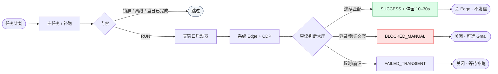

<div align="center">


# 雀魂 Windows 每日静默打开器

### *在本机 Windows 上按当地上午窗口被动打开雀魂，复用专用 Edge 会话，确认大厅后退出*

<a href="#-注意事项"></a>
<a href="../../package.json">=22" height="32"></a>
<a href="../../package.json"></a>
<a href="#-亮点"></a>
<a href="https://github.com/okht/majsoul-windows-daily-login"></a>

<a href="#-安装"></a>
<a href="#-工作流"></a>
<a href="#-安全与边界"></a>
<a href="#-安全与边界"></a>

<br>

<table>
<tr><td align="left">

🕘 &nbsp;想在本机当地上午窗口随机打开一次雀魂，而不是钉死在某一秒闹钟。<br>
🖱️ &nbsp;拒绝自动点登录、填密码、过验证码的脚本。<br>
🔒 &nbsp;登录态、指纹、邮件密钥和日志只留在本机，绝不进 Git。

</td></tr>
</table>

### ✨ 本机任务计划被动打开专用 Edge，只读确认大厅，然后关闭。

**当地 10:00–12:30 → 被动 Edge（CDP）→ 大厅匹配 → 可选停留 10–30 秒 → 静默退出**

<br>

[✨ 亮点](#-亮点) · [⚡ 安装](#-安装) · [🚀 使用](#-使用) · [🧭 工作流](#-工作流) · [🛡 安全](#-安全与边界) · [📂 结构](#-项目结构) · [📌 注意事项](#-注意事项)

[**English**](../../README.md) · [**简体中文**](README_ZH.md)

</div>

---

## ✨ 亮点

面向国服网页版（`https://game.maj-soul.com/1/`）的**纯本机** Windows 运行器：你手动登录一次专用 Edge 配置；日程路径只观察是否进入大厅，**不合成任何输入**。

| 能力 | 做什么 | 为什么重要 |
|---|---|---|
| **本机时区调度** | 主任务：当地 **10:00 + 最长 2.5 小时随机延迟**；补跑：登录/解锁 + 当地 **12:30** 起每 15 分钟 | 「在家上午打开」；不强制北京时间、不拒绝其他系统时区 |
| **系统 Edge + CDP** | 启动本机 `msedge` 与专用 profile，经 CDP 附着（Playwright 持久上下文会导致 WebGL 黑屏） | 真实画布路径，大厅视觉比对可用 |
| **只读大厅门禁** | 指纹阈值 + **连续 2 帧**命中；可访问文本出现登录/验证码则停止 | 确认在大厅，不点进对局 |
| **成功后停留** | `SUCCESS` 后随机 **10–30 秒**再关浏览器 | 给客户端短暂停留，又不会一直挂着 |
| **仅失败邮件** | 可选纯文字 Gmail；**成功不发信** | 正常时安静，出事才提醒 |
| **安装门禁** | `npm run verify` + 本机验收回执后才允许 `Register` | 计划任务只在自检与真实大厅验证通过后注册 |

---

## ⚡ 安装

**环境：** Windows 10/11 · [Node.js](https://nodejs.org/) **≥ 22** · Microsoft Edge · 可访问雀魂（若开邮件还需 Gmail SMTP）。

请在**仓库根目录**执行（不要在空目录乱跑 `npm`）。

```powershell
git clone https://github.com/okht/majsoul-windows-daily-login.git
cd majsoul-windows-daily-login

npm ci
# 若 npm ci 因 lock 不同步失败：npm install

npm run verify
```

`verify` = 单元/集成测试 + 零输入静态检查 + 跟踪树隐私扫描。

<details>
<summary><b>🛠️ 验收通过后的部署模式</b></summary>

<br>

```powershell
powershell -NoProfile -ExecutionPolicy Bypass -File scripts\install.ps1 -Mode DryRun
powershell -NoProfile -ExecutionPolicy Bypass -File scripts\install.ps1 -Mode Deploy
powershell -NoProfile -ExecutionPolicy Bypass -File scripts\install.ps1 -Mode Register
# 或：-Mode Full（verify + 部署；Register 仍需验收回执）
```

</details>

---

## 🚀 使用

### 最短成功路径

| 步骤 | 命令 | 可观察结果 |
|---|---|---|
| **1. 建立会话** | `node src/cli/setup-session.mjs` | 可见 Edge 登录进大厅后按 Enter；无头登记指纹 |
| **2. 无头验证** | `node src/cli/verify-session.mjs` | 输出含 `SUCCESS`（约 1–3 分钟正常） |
| **3. 可选邮件** | `node src/cli/configure-gmail.mjs` | 应用专用密码只进 Windows 凭据管理器 |
| **4. 本机验收** | `npm run acceptance` 或 `npm run acceptance -- --skip-gmail` | 写入 `%LOCALAPPDATA%\MajSoulDaily\acceptance-receipt.json`（仅本机） |
| **5. 部署注册** | `install.ps1 -Mode Deploy` 再 `-Mode Register` | 任务 `MajSoulDaily-Primary` / `MajSoulDaily-Catchup` |

### 日常命令

| 命令 | 作用 |
|---|---|
| `npm run verify` | 测试 + 零输入 + 隐私 |
| `npm run acceptance` | 本机验收回执（可选 `--skip-gmail`） |
| `node src/cli/re-enroll-headless.mjs` | 仅无头刷新指纹 |
| `node src/cli/repair-session.mjs` | 会话失效时可见修复 |
| `scripts\uninstall.ps1` | 卸载任务与本地数据 |

### 部署后手动试跑

```powershell
& "$env:LOCALAPPDATA\MajSoulDaily\app\MajSoulDaily.exe" primary
```

查看下次运行：

```powershell
Get-ScheduledTaskInfo -TaskName "MajSoulDaily-Primary"
```

---

## 🧭 工作流



### 运行时数据（仓库外）

| 路径 | 内容 |
|---|---|
| `%LOCALAPPDATA%\MajSoulDaily\edge-profile` | 专用 Edge 配置（登录态） |
| `%LOCALAPPDATA%\MajSoulDaily\lobby-fingerprint.json` | 不可逆大厅特征（非截图） |
| `%LOCALAPPDATA%\MajSoulDaily\state` | 按**本机本地日期**的状态 |
| `%LOCALAPPDATA%\MajSoulDaily\logs` | 脱敏日志（约 14 天） |
| `%LOCALAPPDATA%\MajSoulDaily\config.json` | 仅 Gmail 地址（若配置） |
| Windows 凭据管理器 | 应用专用密码与指纹密钥 |
| `%LOCALAPPDATA%\MajSoulDaily\app` | 计划任务实际执行的部署副本 |

---

## 🛡 安全与边界

| 做 | 不做 |
|---|---|
| 被动打开官方 URL | 自动点登录/确认/进入游戏 |
| 复用本机专用 Edge 会话 | 在仓库保存雀魂邮箱/密码 |
| 指纹 + 可访问文本只读判断 | 把截图、Cookie、Local Storage 提交到 Git |
| 锁屏不启动 | 唤醒睡眠中的电脑 |
| 可选失败纯文字 Gmail | 成功也发邮件 |
| **本机系统时区** 10:00–12:30 | 强制北京时间 / 拒绝非中国时区安装 |
| 仅本机运行 | 云端浏览器、代理农场、指纹伪装、验证码绕过 |

**仓库内守卫**

1. `npm run check:no-input` — 调度路径禁止合成输入 API。  
2. `npm run check:privacy` — 跟踪文件不得含真实邮箱、密钥、绝对用户路径。  
3. 任务 XML 仅允许启动器参数 `primary` / `catchup`。  
4. 无有效本机验收回执则拒绝 `Register`。

> [!IMPORTANT]
> 公开仓库只有源码与文档。账号、Gmail、Edge 配置、状态、日志、验收回执都在 `%LOCALAPPDATA%\MajSoulDaily` 与凭据管理器中，**不要提交到 Git**。

---

## 📂 项目结构

```text
majsoul-windows-daily-login/
├── src/
│   ├── browser/          # PassiveEdge（CDP）、指纹、大厅检测
│   ├── cli/              # setup / verify / acceptance / gmail / repair
│   └── daily-run.mjs     # 调度门禁、重试、成功停留
├── scripts/
│   ├── install.ps1       # DryRun | Deploy | Register | Full
│   ├── uninstall.ps1
│   ├── check-no-input.mjs
│   └── check-privacy.mjs
├── tools/launcher/       # 无窗口 C# 启动器
├── tests/
└── docs/
    ├── assets/logo.svg   # README 顶部 logo
    ├── lang/README_ZH.md
    └── superpowers/      # 设计与实施计划（历史）
```

---

## 📌 注意事项

- **状态：** 已实现并可本机安装（verify + 验收 + Deploy/Register），**不是**「仅设计阶段」草稿。  
- **许可：** 私人/自用（`package.json` `"private": true`），未发布 OSI 许可证文件。  
- **条款风险：** 自动访问可能受雀魂 / Yostar 服务条款约束。本项目**不**降低可检测性、不绕过平台限制。请自担风险并遵守适用法律。  
- **会话过期：** 运行 `node src/cli/repair-session.mjs`（或重新 setup），再 verify。  
- **设计文档：** [说明](../superpowers/specs/2026-07-16-majsoul-windows-daily-login-design.md) · [计划](../superpowers/plans/2026-07-16-majsoul-windows-daily-login.md) · [修正案](../superpowers/plans/2026-07-16-majsoul-windows-daily-login-corrections.md)

---

## 卸载

```powershell
powershell -NoProfile -ExecutionPolicy Bypass -File scripts\uninstall.ps1
```

---

<div align="center">

Made by <a href="https://github.com/okht"><u>okht</u></a> © 2026

</div>
